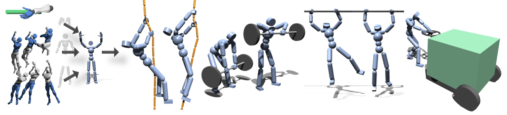

# PMP
<div style="text-align:center">

</div>
<br/>

Official Implementation of "PMP: Learning to Physically Interact with Environments using Part-wise Motion Priors" (SIGGRAPH 2023) ([paper](https://arxiv.org/abs/2305.03249), [video](https://www.youtube.com/watch?v=WdLGvKdNG-0), [talk](https://www.youtube.com/watch?v=WzvFRI5FxRI))

# Status

## Released
- [x] Assets
    - [x] Deepmimic-MPL Humanoid
    - [x] Objects for interaction
    - [ ] Retargeted motion data (check for the license)

- [ ] Simulation Configuration Files
    - [x] `.yaml` files for whole-body and hand-only gyms
    - [ ] documentations about details

- [x] Hand-only Gym : training one hand to grab a bar
    - [x] Model (Train / Test)
        - pretrained weight
        - expert trajectories
    - [x] Environment

## Todo
- [ ] Shell script to install all external dependencies

- [ ] Retargeting pipeline (Mixamo to Deepmimic-MPL Humanoid)

- [ ] Whole-body Gym : training hand-equipped humanoid
    - [ ] Model (Train / Test)
        - pretrained weights
    - [ ] Environments


**Note**) I'm currently focusing on the other projects mainly so this repo will be updated slowly.
In case you require early access to the full implementation, please contact me through my personal [website](https://jinseokbae.github.io/).

# Installation
This code is based on [Isaac Gym Preview 4](https://developer.nvidia.com/isaac-gym).
Please run installation code and create a conda environment following the instruction in Isaac Gym Preview 4.
We assume the name of conda environment is `pmp_env`.
Then, run the following script.

```shell
conda activate pmp_env
cd pmp
pip install -e .
```

# Training
## Hand Control
Our paper introduces interaction prior obtained from hand-only simulation.
We provide example training gym for training hand grasping ([code pointer](isaacgymenvs/tasks/hand_grasp_gym.py)).
Hand-only policy is trained to grasp a bar against arbitrary forces & torques.

We use simple PPO algorithm to train a policy ([code pointer](isaacgymenvs/learning/hand_continuous.py)).
We provide the pretrained weights ([Google Drive](https://drive.google.com/drive/folders/1VFye6g278OLjvEq0yc5grzScyvAUB9c9?usp=sharing)).
Additionally, we share the extracted demonstrations (i.e. pair of state-action) from the pretrained policy, which are later used as interaction prior for the whole-body training.

You can train a policy from scratch using the following commands:
```shell
# train
python train.py headless=True task=HandGrapGym train=HandOnlyPPO experiment=hand_grasping

# test - visualize only one agent
python train.py headless=False test=True num_envs=1 task=HandGrapGym train=HandOnlyPPO checkpoint=pretrained/hand_grasping_weights.pth
```

However, please note that this grasping gym is only the example and you can replace this gym with the customized one that satisfies your end goal (e.g. gym to train punch).

## Whole-body (Humanoid + Hands) Control
TBA


# Acknowledgement
## Codebase
This code is based on the official release of [IsaacGymEnvs](https://github.com/isaac-sim/IsaacGymEnvs).
Especially, this code largely borrows implementations of `AMP` in the original codebase ([paper](https://arxiv.org/abs/2104.02180), [code](https://github.com/isaac-sim/IsaacGymEnvs/blob/main/isaacgymenvs/tasks/humanoid_amp.py)).

## Humanoid
Our whole-body agent is modified from the humanoid in [Deepmimic](https://arxiv.org/abs/1804.02717). 
We replace the sphere-shaped hands of the original humanoid with the hand from [Modular Prosthetic Limb (MPL)](https://dl.acm.org/doi/abs/10.1109/HUMANOIDS.2015.7363441).

## Motion data
We use [Mixamo](https://www.mixamo.com) animation data for training part-wise motion prior.
We retarget mixamo animation data into our whole-body humanoid using the similar process used in the [original codebase](https://github.com/isaac-sim/IsaacGymEnvs).


